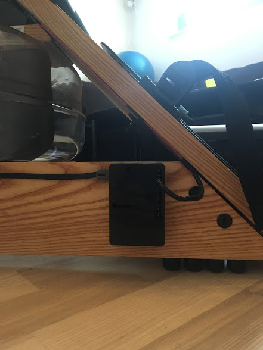
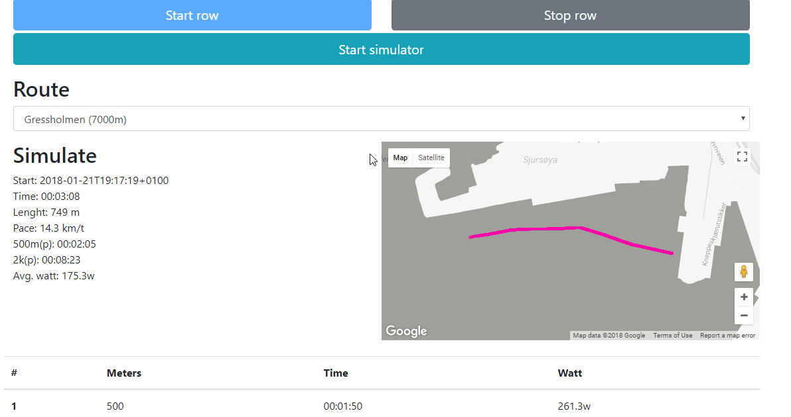
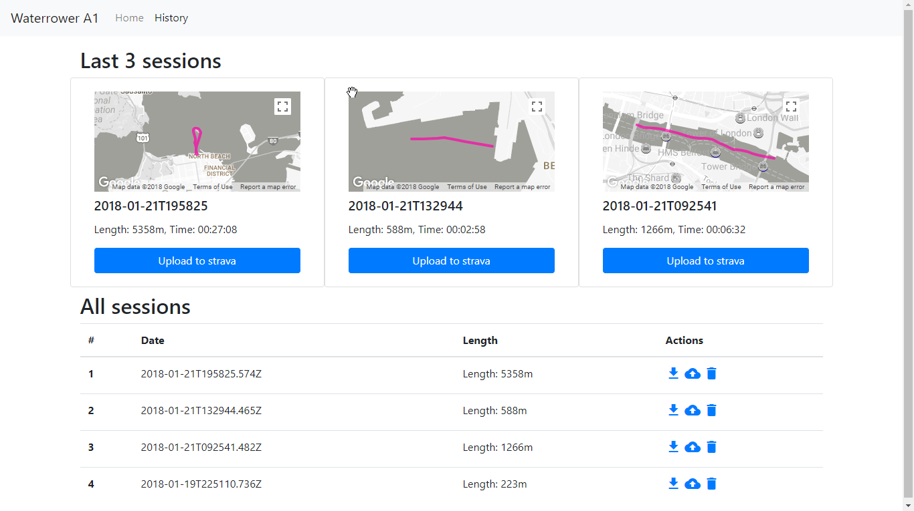

# waterrower-a1-logger

Rasberry Pi 3 project for logging rowing on a WaterRower A1. It will track watt,
pace, length, time and laps. 

It now supports gpx. After a rowing session one can download the gpx file or even
just push it to strava.


## Getting Started
Obviously the WaterRower A1 is needed. I also recommend a 2 EL Wire Splitter Cable and a rasberry pi. Please 
connect the WaterRower A1 sensor to the Raspberry Pi 3. Default this EL Wire Splitter is
to the GPID 4 and ground.  



## Prerequisites
A Raspberry Pi 3 with wifi and running with nodejs. I use nodejs 9.4. Recommend also use of
yarn. 

## Installing
```
mkdir /opt/waterrower
chown pi:pi waterrower
git clone https://github.com/andresol/waterrower-a1-logger.git waterrower
npm install
node app.js
``` 

Install as service. 
```
sudo npm install -g forever
sudo npm install -g forever-service
sudo forever-service install  
```


## Using
After starting the app one can go to the web page. IP:3000. 
Start so a activity. 




## TODO
More routes, better route handling, support for multipe users.
....

## Errors
Please make sure that GPIO is not shared.
First gen of Rasberry Pi is to slow. Please use v3 because of speed and wifi.

## Testing
One can use the parameter ?test=test to get a button that simulates a rowing session.