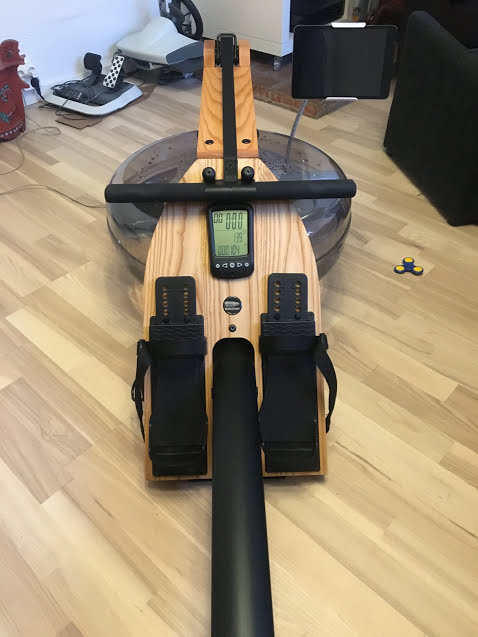
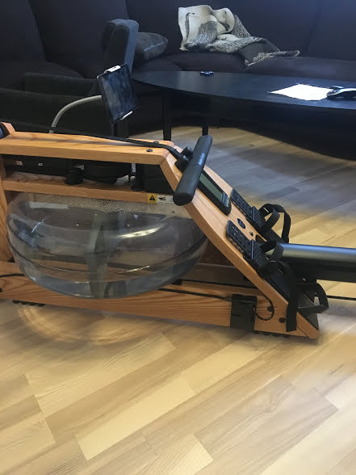

# WaterRower A1 Logger

Raspberry Pi 3 project for logging rowing on a WaterRower A1. It will track watt,
pace, length, time, laps and heart rate (Needs ant plus stick). 

The most important feature is the route feature. One needs to select route before starting a row session. 
This route will be used as a template for the row session. After a rowing session is done one can download 
the gpx file or even just push it to Strava.


## Getting Started
Obviously the WaterRower A1 is needed. I also recommend a 2 EL Wire Splitter Cable and a Rasberry Pi 3. Please 
connect the WaterRower A1 sensor to the Raspberry Pi 3. Connect the 2 EL Wire Splitter is
to the GPID 4 and ground on the RP3. Doesn't matter which way! This is a hacking project, and I am not I 
am not responsible for any damage caused by any problems that may arise! 


## Prerequisites
A Raspberry Pi 3 with wifi and running with nodejs. I use nodejs 9.4. Recommend also use of
yarn over npm. 

## Installing
```
mkdir /opt/waterrower
chown pi:pi waterrower
git clone https://github.com/andresol/waterrower-a1-logger.git waterrower
npm install
node app.js
``` 

### Heart rate with Ant plus
This program supports heart rate by usb ant+ stick. Please install drivers with
```
 sudo apt-get install build-essential libudev-dev
```

Install as service. 
```
sudo npm install -g forever
sudo npm install -g forever-service
sudo forever-service install  
```

## Using
After starting the app one can go to the web page by typing its IP:3000 int
the browser. E.g https://192.168.1.190:3000. I use a iPad mini with and iPad holder.


## Strava
This is in a beta stage, but look at https://www.npmjs.com/package/strava-v3
Basic you need to do the quick start guide. After that you need to
create get a writeable access_token. Look at the "Running the tests" section.

## Mounting
Mounting the cable and Raspberry Pi 3 is done with only glue and double sided tape.

## TODO
Complete strava integration, more routes, better route handling, live view of rowing session. 

## Errors
Please make sure that GPIO is not shared.
First gen of Rasberry Pi is to slow. Please use v3 because of speed and wifi.

## Note
This project was just a test project to see if it was possible to create a my own computer. It is badly
written code that is just patched together. This project needs to be written again. Important notes if
one wants to create there own project on the WaterRower A1. The WaterRower uses a magnet and the length
in real world is that one rows 20.81 cm between each magnet hit. It is important to use some kind of 
debounce to prevent false hits. 

Ratio:
100 cm is 4.805 clicks. 1 click is about 20.81 cm.


## Testing
One can use the parameter ?test=test to get a button that simulates a rowing session.

## Screenshots




