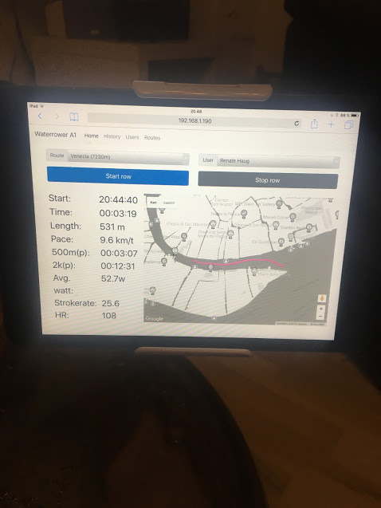

# waterrower-a1-logger

Raspberry Pi 3 project for logging rowing on a WaterRower A1. It will track watt,
pace, length, time and laps. If you own a heart rate ant plus stick it is also supported.

It now supports gpx. After a rowing session one can download the gpx file or even
just push it to strava(beta).


## Getting Started
Obviously the WaterRower A1 is needed. I also recommend a 2 EL Wire Splitter Cable and a rasberry pi. Please 
connect the WaterRower A1 sensor to the Raspberry Pi 3. Connect the 2 EL Wire Splitter is
to the GPID 4 and ground. Doesn't matter which way! This is a hacking project, and I am not I 
am not responsible for any damage caused by any problems that may arise! 


## Prerequisites
A Raspberry Pi 3 with wifi and running with nodejs. I use nodejs 9.4. Recommend also use of
yarn. 

## Installing
```
mkdir /opt/waterrower
chown pi:pi waterrower
git clone https://github.com/andresol/waterrower-a1-logger.git waterrower
npm install
node app.js
``` 

### Heart rate with Ant plus
This program supports heart rate by usb ant+ stick. Please install drivers with
```
 sudo apt-get install build-essential libudev-dev
```


Install as service. 
```
sudo npm install -g forever
sudo npm install -g forever-service
sudo forever-service install  
```

## Using
After starting the app one can go to the web page. IP:3000. 
Start so a activity.  E.g 192.168.1.190:3000. I use a iPad mini with and iPad holder.


## Strava
This is in a beta stage, but look at https://www.npmjs.com/package/strava-v3
Basic you need to do the quick start guide. After that you need to
create get a writeable access_token. Look at the "Running the tests" section.

## Mounting
Mounting the cable and Raspberry Pi 3 is done with glue and double sided tape.

## TODO
Complete strava integration, more routes, better route handling, live view of rowing session. 

## Errors
Please make sure that GPIO is not shared.
First gen of Rasberry Pi is to slow. Please use v3 because of speed and wifi.

## Testing
One can use the parameter ?test=test to get a button that simulates a rowing session.

## Screenshots





